<p align="center">
  
</p>

<p align="center">
  
  
  
  
  
</p>

# OmniverseViewportSpoutSender

Real-time **Spout** GPU texture streaming of the active viewport for **NVIDIA Omniverse Kit 109**.

Stream the rendered viewport (no UI chrome) of any Kit-based app to Spout-aware applications such as **TouchDesigner**, **Resolume**, **OBS**, **MadMapper**, vMix, Notch, etc. — Windows only.

Ships as a single Kit extension: `kit109.viewport_spout`. Sender name on the Spout network: `OmniverseViewport`.

Built on top of our own **[SPOUT2ForPython](https://github.com/UnveilStudio/SPOUT2ForPython)** — the bundled `spout/` package inside the extension is that exact ctypes layer, vendored in so the extension is self-contained and you don't have to `pip install` anything to run it inside Kit.

> **Disclaimer.** This is an unofficial, community-built Kit extension. It is **not affiliated with, sponsored by, or endorsed by NVIDIA Corporation**. "NVIDIA," "Omniverse," and "Kit" are trademarks of NVIDIA Corporation, referenced here only to identify the platform this extension is compatible with (nominative fair use). The extension consumes public Kit Python APIs (`omni.kit.renderer.capture`, `omni.kit.viewport.utility`, `omni.kit.hydra_texture`, `omni.ui`) — it does **not** redistribute, modify, or replace any NVIDIA software component. The Kit SDK itself is licensed by NVIDIA under their own [Software License Agreement](https://www.nvidia.com/en-us/agreements/enterprise-software/nvidia-software-license-agreement/) and must be obtained directly from NVIDIA.

## How it works

```mermaid
flowchart LR
    KIT["Kit 109 viewport<br/>(RTX render)"] --> HYD["omni.hydratexture<br/>DRAWABLE_CHANGED"]
    HYD --> CAP["IRendererCapture<br/>capture_next_frame_rp_resource"]
    CAP --> CB["PyCapsule callback<br/>(buf, w, h, fmt)"]
    CB --> CT["ctypes.PyCapsule_GetPointer<br/>→ raw void*"]
    CT --> SDR["spout.SpoutSender<br/>send_image(ptr, w, h, BGRA)"]
    SDR --> DLL["SpoutLibrary.dll<br/>v2.007.017"]
    DLL --> DX["DirectX 11<br/>shared NT handle"]
    DX --> GPU[(GPU shared texture<br/>'OmniverseViewport')]
    GPU -.-> EXT["TouchDesigner / Resolume<br/>OBS / vMix / Notch"]

    classDef omni fill:#0a1f0a,stroke:#76B900,stroke-width:2px,color:#fff
    classDef py fill:#1e1e2e,stroke:#aa6eff,stroke-width:2px,color:#fff
    classDef sys fill:#0d1117,stroke:#444,color:#fff
    classDef gpu fill:#1c3a14,stroke:#76B900,stroke-width:2px,color:#fff
    class KIT,HYD,CAP omni
    class CB,CT,SDR py
    class DLL,DX sys
    class GPU gpu
    class EXT sys
```



**Total copies per frame**: GPU→CPU readback (unavoidable from Python) + CPU→GPU upload into the Spout DX11 shared texture.

The capture path is **viewport-only LDR color** — no UI chrome, no overlays, no menus. The sender keeps a `_capture_pending` guard so that if downstream readback is slower than the render rate, frames are dropped instead of queueing up.

## A small love letter to Omniverse

Read this as fan mail to NVIDIA, not a feature request.

Omniverse is one of the most beautiful pieces of infrastructure ever shipped to creative tooling. USD as a live scene. Hydra render delegates. Multi-GPU RTX out of the box. The Carb plugin system. A whole Kit app that is, at its core, just a manifest of extensions. As people who live on stage and behind a TouchDesigner patch, we look at it and we see the operating system the live-show, VFX and motion-design world has been quietly missing.

The catch is that the most beautiful part — the **RTX renderer** — is the one we can't bring home with us. It can't be redistributed, embedded, or dropped into a custom 3D app the way Spout's runtime drops into yours. We get the business reason. We just want to say, gently: the day NVIDIA ships an RTX runtime DLL — or, dream of dreams, opens the path tracer — an entire generation of live visualists, club VJs, projection mappers and motion designers will lose their minds. RTX realtime has a quality game-engine lighting simply doesn't reach. It's a different kind of light.

It's also a little wild that a renderer this good, multi-GPU and multi-process aware by default, is still chasing Unity and Unreal in the public imagination, when the engineering underneath is in many places already further along. We'd love to see Omniverse get the love it deserves on the *show* side of the industry, not only the digital-twin and industrial side.

So: thank you, NVIDIA. Thank you for keeping Kit open enough that we can ship extensions like this one. Thank you for the multi-GPU realtime that nobody else is shipping. And thank you, in advance, for whatever future version of this stack lets us put Omniverse rendering inside a live performance. We'll be here, ready, with a Spout receiver patched in.

— The Unveil Studio crew, with love. 💚

## Requirements

- Windows 10 / 11 x64
- NVIDIA Omniverse **Kit SDK 109** (USD Composer, custom apps built from `kit-app-template`, etc.)
- DirectX 11 capable GPU (any NVIDIA GeForce / RTX from the last decade is fine)
- A Spout receiver to display the stream — TouchDesigner *Spout In TOP*, Resolume, OBS with the *Spout2 Plugin*, etc.

## Install

### Quick install — `install.bat` (recommended)

Clone this repo so that it sits **inside** your `kit-app-template/` (next to `repo.bat`) **or** as a **sibling** of it, then double-click `install.bat`. That's it.

```text
D:\YourWork\
├── kit-app-template\
│   ├── repo.bat
│   └── source\
└── OmniverseViewportSpoutSender\         ← clone us here
    └── install.bat                       ← double-click
```

The installer:

1. Locates the kit-app-template root by looking for `repo.bat`
2. Creates a Windows **junction** at `<kit-app-root>\source\extensions\kit109.viewport_spout` pointing back to this repo's source — **no copy, no admin rights**, and `git pull` here updates the live extension instantly
3. Adds `"kit109.viewport_spout" = {}` to `[dependencies]` of every `.kit` file under `<kit-app-root>\source\apps\` (idempotent — re-running won't double-patch)

Then build and launch as usual:
```powershell
cd <kit-app-template>
.\repo.bat build
.\repo.bat launch
```

The **Spout Viewport Sender** window appears once Kit boots. Click *Start Streaming* and you're broadcasting as `OmniverseViewport` on the Spout network.

> **Uninstall**: delete the junction with `cmd /c rmdir "<kit-app-template>\source\extensions\kit109.viewport_spout"` — **do NOT** `Remove-Item -Recurse`, it would follow the junction and wipe this repo. Then remove the dependency line from your `.kit` file.

### Manual install

If you'd rather wire it up by hand:

1. Copy (or `mklink /J`) `source/extensions/kit109.viewport_spout/` into your kit-app-template's `source/extensions/`.
2. Add the extension to your `.kit` file's `[dependencies]`:
   ```toml
   "kit109.viewport_spout" = {}
   ```
3. Rebuild: `.\repo.bat build` — the build creates an internal junction from `_build/.../exts/` back to the source folder.
4. Launch: `.\repo.bat launch`.

### Option C — Extension Manager search path

Skip the build step entirely: point Kit's *Extension Manager* at this repo's `source/extensions/` folder and enable `kit109.viewport_spout` from the UI. Useful for trying it inside a vanilla Kit app without touching its `.kit` file.

## Usage

Open the **Spout Viewport Sender** window (auto-shown on extension load) and click **Start Streaming**. The sender appears as `OmniverseViewport` in any Spout-aware app.

To change the sender name, edit the literal in `kit109/viewport_spout/extension.py`:
```python
self._sender = SpoutSender("OmniverseViewport")
```

## Repo layout

```
source/extensions/kit109.viewport_spout/
├── config/
│   └── extension.toml          # Kit metadata + dependencies
├── kit109/
│   └── viewport_spout/
│       ├── __init__.py         # exports ViewportSpoutExtension
│       └── extension.py        # IExt: UI + capture pipeline
├── spout/                      # bundled Python ctypes bindings to Spout2
│   ├── __init__.py
│   ├── _lib.py                 # SpoutLibrary.dll loader + vtable indices
│   ├── sender.py               # SpoutSender wrapper
│   ├── receiver.py             # SpoutReceiver wrapper (not used here)
│   ├── utils.py                # SpoutUtils helpers
│   └── SpoutLibrary.dll        # Spout2 v2.007.017 (x64)
└── premake5.lua                # links kit109/ and spout/ into target_dir
```

## Gotchas (the hard-won lessons)

- `kit109/viewport_spout/__init__.py` **must** import the class — `from .extension import ViewportSpoutExtension`. If empty, Kit silently finds no `IExt` and never calls `on_startup`. No error is logged.
- `SpoutLibrary.dll` **must** sit inside the `spout/` package. The Carb-tokens fallback path is unreliable — keep the DLL bundled.
- `ctypes` argtype for the pixel buffer in `sender.py`'s `send_image` vtable call must be **`c_void_p`**, not `c_char_p`, or you get `argument 2: TypeError: wrong type`.
- Module-level imports of `spout` fail silently if the DLL is missing — Kit swallows the `ImportError` and marks the extension "started" with no class instantiated. Imports are kept lazy inside `on_startup` to surface them.
- The build creates **Windows junctions** at `_build/windows-x86_64/release/exts/kit109.viewport_spout/` pointing back to the source. Python edits are picked up live, no rebuild needed. If real directories already exist there (e.g. from a manual `cp -r`), the build errors out — delete them and rebuild.

## Credits

> **Built on top of [Spout2](https://github.com/leadedge/Spout2) by Lynn Jarvis.**
> All the heavy lifting — the DirectX shared-texture protocol, the GL/DX
> interop, the `SpoutLibrary.dll` itself, fifteen years of patient maintenance —
> is his work. This extension is a thin Kit-flavoured wrapper that hands a
> viewport framebuffer to Spout and lets that magic DLL do its thing.
> Huge thanks to Lynn and the Spout community for keeping the project alive,
> stable, and open. ❤️
>
> Bundled: `SpoutLibrary.dll` v2.007.017 (x64).

- **[UnveilStudio/SPOUT2ForPython](https://github.com/UnveilStudio/SPOUT2ForPython)** — **the actual base of this implementation.** The `spout/` package vendored inside `kit109.viewport_spout/` (`_lib.py`, `sender.py`, `receiver.py`, `utils.py` + `SpoutLibrary.dll`) is a verbatim copy of that repo's ctypes bindings. We wrote SPOUT2ForPython first as a standalone Python wrapper around Spout2, then dropped it in here so the Kit extension stays self-contained — no `pip install`, no PYTHONPATH tricks, just `repo.bat build` and run.
- **NVIDIA Omniverse Kit SDK** — capture pipeline relies on `omni.kit.renderer.capture` and `omni.kit.hydra_texture`. See the love letter above.
- **[SpoutForPython](https://github.com/leadedge/SpoutForPython)** by Lynn Jarvis — earlier reference Python wrapper around Spout2; SPOUT2ForPython is a from-scratch reimplementation pinned to `SpoutLibrary.h v2.007.017` to avoid ABI drift, but we owe the original idea to Lynn's prior art.

## License

This extension is released under the **MIT License** — see [LICENSE](LICENSE).

`SpoutLibrary.dll` is distributed under the upstream **BSD-2-Clause** Spout2 license; see the bottom of [LICENSE](LICENSE) for the full text.
