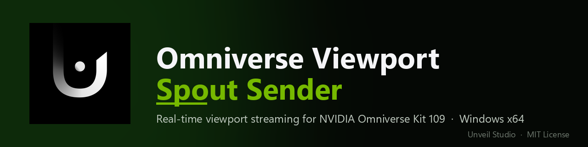

<p align="center">
  
</p>

<p align="center">
  
  
  
  
  
</p>

# OmniverseViewportSpoutSender

Real-time **Spout** GPU texture streaming of the active viewport for **NVIDIA Omniverse Kit 109**.

Stream the rendered viewport (no UI chrome) of any Kit-based app to Spout-aware applications such as **TouchDesigner**, **Resolume**, **OBS**, **MadMapper**, vMix, Notch, etc. — Windows only.

Ships as a single Kit extension: `kit109.viewport_spout`. Sender name on the Spout network: `OmniverseViewport`.

## How it works

```mermaid
flowchart LR
    KIT["Kit 109 viewport<br/>(RTX render)"] --> HYD["omni.hydratexture<br/>DRAWABLE_CHANGED"]
    HYD --> CAP["IRendererCapture<br/>capture_next_frame_rp_resource"]
    CAP --> CB["PyCapsule callback<br/>(buf, w, h, fmt)"]
    CB --> CT["ctypes.PyCapsule_GetPointer<br/>→ raw void*"]
    CT --> SDR["spout.SpoutSender<br/>send_image(ptr, w, h, BGRA)"]
    SDR --> DLL["SpoutLibrary.dll<br/>v2.007.017"]
    DLL --> DX["DirectX 11<br/>shared NT handle"]
    DX --> GPU[(GPU shared texture<br/>'OmniverseViewport')]
    GPU -.-> EXT["TouchDesigner / Resolume<br/>OBS / vMix / Notch"]

    classDef omni fill:#0a1f0a,stroke:#76B900,stroke-width:2px,color:#fff
    classDef py fill:#1e1e2e,stroke:#aa6eff,stroke-width:2px,color:#fff
    classDef sys fill:#0d1117,stroke:#444,color:#fff
    classDef gpu fill:#1c3a14,stroke:#76B900,stroke-width:2px,color:#fff
    class KIT,HYD,CAP omni
    class CB,CT,SDR py
    class DLL,DX sys
    class GPU gpu
    class EXT sys
```



**Total copies per frame**: GPU→CPU readback (unavoidable from Python) + CPU→GPU upload into the Spout DX11 shared texture.

The capture path is **viewport-only LDR color** — no UI chrome, no overlays, no menus. The sender keeps a `_capture_pending` guard so that if downstream readback is slower than the render rate, frames are dropped instead of queueing up.

## A small love letter to Omniverse

A note we wanted to put somewhere — read it as fan mail to NVIDIA, not a feature request.

NVIDIA Omniverse is, in our completely-not-impartial opinion, **one of the most beautiful pieces of infrastructure ever shipped to creative tooling**. The composability of USD as a runtime scene, the Hydra render delegates abstraction, the multi-GPU RTX path, the Carb plugin system, the way the whole Kit application is itself just a manifest of extensions — there is so much craft in there it almost hurts. As people who live on stage and behind a TouchDesigner network, we look at Omniverse and we see the operating system we wish the show-business / creative VFX / motion-design world had.

And yet — the gorgeous part of it, the **RTX renderer**, is the one bit you can never really invite home. It can't be redistributed. It can't be embedded. It can't be a `.dll` you drop into a custom 3D app the way Spout's runtime drops into yours. We *get* the business reason. We just want to put on record, gently, that **the day NVIDIA ships an RTX runtime DLL — or, dream of dreams, source for the path tracer — under any kind of redistribute-friendly license, an entire generation of live-show, club-visual, projection-mapping, and motion-graphics people will lose their minds**. RTX-quality real-time has a particular fascination that game-engine-biased lighting just doesn't reach. It's a different kind of light.

It's also a little wild that **a renderer this good, multi-GPU and multi-process aware out of the box, is still chasing Unity and Unreal as a "game engine"** in the public mind, when the engineering underneath is in many places further along. We'd love to see Omniverse get the love it deserves on the *show* side of the world, not just the digital-twin / industrial side.

So: thank you, NVIDIA. Thank you for keeping `Kit` open enough that we can write extensions like this one. Thank you for the multi-GPU realtime that nobody else is shipping. And thank you, in advance, for whatever future version of this stack lets us actually ship Omniverse rendering inside a live performance. We'll be here, ready, with a Spout receiver patched in.

— The Unveil Studio crew, with love. 💚

## Requirements

- Windows 10 / 11 x64
- NVIDIA Omniverse **Kit SDK 109** (USD Composer, custom apps built from `kit-app-template`, etc.)
- DirectX 11 capable GPU (any NVIDIA GeForce / RTX from the last decade is fine)
- A Spout receiver to display the stream — TouchDesigner *Spout In TOP*, Resolume, OBS with the *Spout2 Plugin*, etc.

## Install

### Option A — drop into a `kit-app-template` repo

1. Copy `source/extensions/kit109.viewport_spout/` into your repo's `source/extensions/` directory.
2. Add the extension to your `.kit` file's `[dependencies]`:
   ```toml
   "kit109.viewport_spout" = {}
   ```
3. Rebuild: `.\repo.bat build` — the build creates a junction from `_build/.../exts/` back to the source folder.
4. Launch: `.\repo.bat launch`. The **Spout Viewport Sender** window appears; click **Start Streaming**.

### Option B — register as an external extension search path

Point Kit's Extension Manager at this repo's `source/extensions/` folder and enable `kit109.viewport_spout` from the Extension Manager UI.

## Usage

Open the **Spout Viewport Sender** window (auto-shown on extension load) and click **Start Streaming**. The sender appears as `OmniverseViewport` in any Spout-aware app.

To change the sender name, edit the literal in `kit109/viewport_spout/extension.py`:
```python
self._sender = SpoutSender("OmniverseViewport")
```

## Repo layout

```
source/extensions/kit109.viewport_spout/
├── config/
│   └── extension.toml          # Kit metadata + dependencies
├── kit109/
│   └── viewport_spout/
│       ├── __init__.py         # exports ViewportSpoutExtension
│       └── extension.py        # IExt: UI + capture pipeline
├── spout/                      # bundled Python ctypes bindings to Spout2
│   ├── __init__.py
│   ├── _lib.py                 # SpoutLibrary.dll loader + vtable indices
│   ├── sender.py               # SpoutSender wrapper
│   ├── receiver.py             # SpoutReceiver wrapper (not used here)
│   ├── utils.py                # SpoutUtils helpers
│   └── SpoutLibrary.dll        # Spout2 v2.007.017 (x64)
└── premake5.lua                # links kit109/ and spout/ into target_dir
```

## Gotchas (the hard-won lessons)

- `kit109/viewport_spout/__init__.py` **must** import the class — `from .extension import ViewportSpoutExtension`. If empty, Kit silently finds no `IExt` and never calls `on_startup`. No error is logged.
- `SpoutLibrary.dll` **must** sit inside the `spout/` package. The Carb-tokens fallback path is unreliable — keep the DLL bundled.
- `ctypes` argtype for the pixel buffer in `sender.py`'s `send_image` vtable call must be **`c_void_p`**, not `c_char_p`, or you get `argument 2: TypeError: wrong type`.
- Module-level imports of `spout` fail silently if the DLL is missing — Kit swallows the `ImportError` and marks the extension "started" with no class instantiated. Imports are kept lazy inside `on_startup` to surface them.
- The build creates **Windows junctions** at `_build/windows-x86_64/release/exts/kit109.viewport_spout/` pointing back to the source. Python edits are picked up live, no rebuild needed. If real directories already exist there (e.g. from a manual `cp -r`), the build errors out — delete them and rebuild.

## Credits

> **Built on top of [Spout2](https://github.com/leadedge/Spout2) by Lynn Jarvis.**
> All the heavy lifting — the DirectX shared-texture protocol, the GL/DX
> interop, the `SpoutLibrary.dll` itself, fifteen years of patient maintenance —
> is his work. This extension is a thin Kit-flavoured wrapper that hands a
> viewport framebuffer to Spout and lets that magic DLL do its thing.
> Huge thanks to Lynn and the Spout community for keeping the project alive,
> stable, and open. ❤️
>
> Bundled: `SpoutLibrary.dll` v2.007.017 (x64).

- **NVIDIA Omniverse Kit SDK** — capture pipeline relies on `omni.kit.renderer.capture` and `omni.kit.hydra_texture`. See the love letter above.
- **[SpoutForPython](https://github.com/leadedge/SpoutForPython)** by Lynn Jarvis — inspired the bundled `spout/` ctypes layout. The bindings here are a from-scratch reimplementation pinned to `SpoutLibrary.h v2.007.017` to avoid ABI drift.
- **Sister repos** in the Unveil Studio family — same shape of "thin Python over a magic Windows DLL":
  - [SPOUT2ForPython](https://github.com/UnveilStudio/SPOUT2ForPython) — same bindings, packaged for general Python use
  - [NDIForPython](https://github.com/UnveilStudio/NDIForPython) — NDI 6 sender/receiver for Python

## License

This extension is released under the **MIT License** — see [LICENSE](LICENSE).

`SpoutLibrary.dll` is distributed under the upstream **BSD-2-Clause** Spout2 license; see the bottom of [LICENSE](LICENSE) for the full text.
